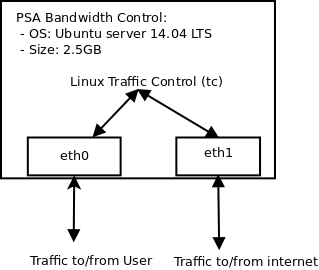
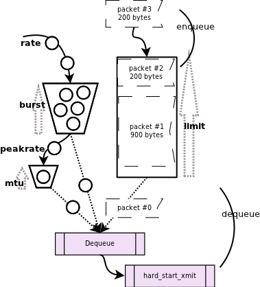

Bandwidth Control PSA
===================
# 1. End-user 

## 1.1 Description / general readme
The Bandwidth Control PSA is a personal security application that allows a user to manage his network connection's bandwidth.
The user can set specific upper bounds for the downlink and uplink rate of his network connection in KB/s. The PSA works by performing traffic shaping
on the user traffic to apply the requested upper bounds by using a queue to enqueue packets and dequeue in a manner that respects the required rate. 

## 1.2 Features / Capabilities

The capabilities of the Bandwidth Control PSA include:

* Limit download speed
* Limit upload speed

## 1.3 Security policy examples

The following examples list *all the possibly policies* that can be enabled from the SECURED GGUI.

```"I, reduce(s) bandwidth , downlink X KB/s, uplink Y KB/s  "```
- This policy enables PSA Bandwidth Control with an upper bound on downlink rate of X KB/s and an upper bound on uplink rate of Y KB/s 


# 2. Developer / admin

## 2.1 Description / general readme

The Bandwidth Control PSA is implemented using the Linux Traffix Control (tc)
to perform traffic shaping inside a VM that is used as a gateway for user traffic. 
Traffic from the local LAN enters through eth0 and traffic from the Internet enters eth1. 
This way we can use the egress queue of each interface to perform shaping both for ingress 
and egress traffic to and from the local LAN. We use eth0's egress queue
to shape downlink traffic and eth1's egress queue to shape uplink traffic. This procedure is shown in the figures below:





In order to perfom traffic shaping the PSA chnages the default pfifo_fast queue discipline on the interfaces
and instead attaches a token buffer filter (TBF) queue discipline to perform very simple traffic shaping without using any other classful queue disciplines.
Thus, we do no prioritize traffic and all packets are handled uniformly. The TBF queue discipline uses a token buffer algorithm to send packets. 
Namely, tokens are generated in a specific rate which fill a 'bucket'. A packet depending on its size in bits requires a specific number of tokens in order for it 
to be transmitted, the larger the packet the more tokens. If there are enough tokens the packet is transmitted otherwise it is enqueued because TBF perfrorms shaping 
and not policing. When the buccket has no more tokens or not the right amount of tokens for the packet the remaining packets are stalled for a specific time 
until more tokens are generated. As a last resort to keep the rate at the specific limit, if after the specific time no enough tokens are generated the 
packet is dropped. Therefore, this way the TBF sends packets given that a specific send rate is not violated and this way it 'slows down' an interface. 

The operation of the Token Buffer Filter Queue discipline is shown below:

 


When performing traffic shaping using Linux tc the following notation for rates is used:
* kbps -> KB/s
* mbps -> MB/s
* kbit -> Kb/s
* mbit -> Mb/s

The above notation can be used to specify the required rate for any queue discipline supported by Linux TC.


### PSA Bandwidth Limitation specific configurations

After manual testing using the TBF queue discipline the following configuartions for latency and burst have been empirically identified to provide stable rate limiting:

Latency: in ms (milliseconds), the time a packet can wait in queue. Suggested values:
 * If rate >2MB/s then set latency at 30ms else set latency at 25ms

	
Burst: Also known as buffer or maxburst. Size of the bucket, in bytes. This is the maximum amount of bytes that tokens can be available for instantaneously. In general, larger shaping rates require a larger buffer. 
Suggested values:
 * if rate >2MB/s  then  set burst at 30K else set burst at 15K

### Core Functionality

Using the above empirical limits and the specified rate requested by the user the core functionality of the PSA applies a TBF on the root of the 
correct interface to limit either downlink or uplink rate:
```
/sbin/tc qdisc add dev {DEVICE} handle 10:0 root tbf rate {RATE} latency {LATENCY} burst {BURST}
```

The above command applies the TBF queue discipline (qdisc) on the root of the proper {DEVICE}:
* eth0 to limit downlink traffic
* eth1 to limit uplink traffic

'handle 10:0' simply creates the reference (handle) 10:0 for the qdisc which can be used to attach further disciplines on this queue.

{RATE} is the rate in KB/s requested by the user and {LATENCY} and {BURST} are calculated based on the empirical thresholds as shown above.

## 2.2 Support, troubleshooting / known issues

### Technologies Used
VM technology allows creating a full system for the PSA. The components used in this PSA are:

* Operative System: Ubuntu Server 14.04 LTS
* Linux Traffic Control (tc) ~ Token Buffer Filter Queue (tbf)

### Testing Methodology
In order to test the PSA using local accounts follow this [guide](tests).

### PSA VM Image
 - PSA Bandwidth Control: https://vm-images.secured-fp7.eu/images/priv/PSA-bwcontrol.img
 - This PSA uses Ubuntu Server 14.04 LTS instead of Debian
 - It has a size of 2.5GB. It has been tested with 1024MB of RAM.
 - Credentials: user = root, passwd = secured

### Manifest

The PSA manifest is available at [Manifest](NED_files/TVDM/PSAManifest/bwcontrol). 

This file is currently used by the NED to start the PSA.

### HSPL

The HSPL to be used to enable the Bandwidth Control PSA is the following:

```"I, reduce(s) bandwidth , downlink X KB/s, uplink Y KB/s  "```
- This policy enables PSA Bandwidth Control with an upper bound on downlink rate of X KB/s and an upper bound on uplink rate of Y KB/s 

### MSPL

Example MSPL file for this PSA can be found below:

[bwcontrol.xml](MSPL/bwcontrol_mspl.xml): The MSPL contains the user sepecification of downlink and uplink speed to be used by enforced by the PSA in KB/s. 

Using the above MSPL the PSA's M2L plugin can extract the requested limits and prepare the PSA configuration to enforce these limits.

### M2L Plug-in

The M2l plug-in is available at [M2LPlugin](M2L/M2LPlugin.java)

The M2L plugin parses the MSPL to get the downlink and uplink rates requested by the user:

```java

double downlink = ((ReduceBandwidthAction) ((RuleSetConfiguration) itResource.getConfiguration())
					.getDefaultAction()).getReduceBandwidthActionType().getDownlinkBandwidthValue();
double uplink = ((ReduceBandwidthAction) ((RuleSetConfiguration) itResource.getConfiguration())
					.getDefaultAction()).getReduceBandwidthActionType().getUplinkBandwidthValue();
					
```

and after the limits are extracted and validated, the appropriate additional aparameters are calculated and finally the configuration is prepared:
```java
/**
		 * Initial lines of the configuration file. If no limits have been
		 * specified these will be the only two lines in the psaconf.
		 */
		String configuration = "#!/bin/bash\nTC=/sbin/tc\n\n";

		/**
		 * If a downlink rate has been specified then we add the required
		 * configuration to the configuration file.
		 */
		if (downlinkRate != -1) {
			configuration += "LAN=eth0\n";
			configuration += "LAN_R=" + String.valueOf(downlinkRate) + "kbps\n";
			configuration += "LAN_B=" + downlinkBurst + "\n";
			configuration += "LAN_L=" + downlinkLatency + "\n";
			configuration += "#Clearing the downlink limits\n";
			configuration += "$TC qdisc del dev $LAN root\n";
			configuration += "#Apply the downlink limits\n";
			configuration += "$TC qdisc add dev $LAN handle 10:0 root tbf rate $LAN_R latency $LAN_L burst $LAN_B\n\n";
		}

		/**
		 * If an uplink rate has been specified then we add the required
		 * configuration to the configuration file.
		 */
		if (uplinkRate != -1) {
			configuration += "WAN=eth1\n";
			configuration += "WAN_R=" + String.valueOf(uplinkRate) + "kbps\n";
			configuration += "WAN_B=" + uplinkBurst + "\n";
			configuration += "WAN_L=" + uplinkLatency + "\n";
			configuration += "#Clearing the uplink limits\n";
			configuration += "$TC qdisc del dev $WAN root\n";
			configuration += "#Apply the downlink limits\n";
			configuration += "$TC qdisc add dev $WAN handle 10:0 root tbf rate $WAN_R latency $WAN_L burst $WAN_B";
		}
```

### License

Please refer to project LICENSE file.


### TODO
Integration testing in partner test-beds.

## 2.3 Features / Capabilities
The list of capabilities are (extracted from manifest):
* Reduce_Bandwidth


## 2.4 Support, troubleshooting / known issues
* The Token Buffer Queue did not show stable performance using Debian 7 'wheezy'. Using the PSA image with the aforementioned OS the rate showed flucatations
and it did not stabilize well in the specified rate. Changing the PSA OS to Ubuntu 14.04 LTS and using the same configuration illustrated a stable performance
as expected. One observation is that the TBF queue discipline achieves 90% of the specified rate. All the experiments illustate this behavior and thus this must have to do with 
  the implementation inside the Linux Kernel of the TBF algorithm.

## 2.5 Future Software Improvemenet Ideas
Linux Traffic Control provides more complex queue disciplnes like Hirerchical Token Buffer Filter that can be used to create trees of queue disciplines
to handle specific traffic in different ways. It can allow to give specific traffic identified by a variety of parameters different priority and different rates thus creating more complex scenarios. 

## 2.6 Partners involved

* Application: PTL
* MSPL: POLITO,PTL
* M2L Plugin: PTL